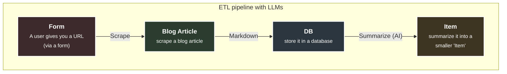
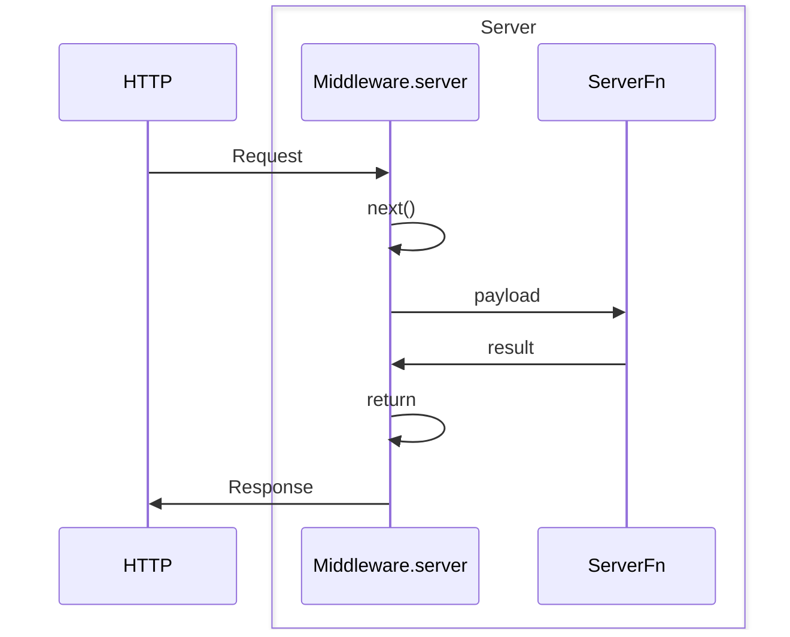

# Outline

- https://github.com/ski043/tanstack-start-firecrawl-ai-yt
- https://www.youtube.com/watch?v=FsIASz_Uvd0
- https://www.bilibili.com/video/BV1RkFAznEVa/

## Intro

- [00:00](https://www.youtube.com/watch?v=FsIASz_Uvd0) Intro
- [04:05](https://www.youtube.com/watch?v=FsIASz_Uvd0&t=245s) What is TanStack Start
- [06:00](https://www.youtube.com/watch?v=FsIASz_Uvd0&t=360s) TanStack Start Architecture and Composition
- [11:00](https://www.youtube.com/watch?v=FsIASz_Uvd0&t=660s) Setting up a new project
- [18:00](https://www.youtube.com/watch?v=FsIASz_Uvd0&t=1080s) Analyzing Project Directory (Folder Structure)

## Route

- [24:00](https://www.youtube.com/watch?v=FsIASz_Uvd0&t=1440s) Routing Deep Dive
- [45:00](https://www.youtube.com/watch?v=FsIASz_Uvd0&t=2700s) Nesting Routes
- [54:00](https://www.youtube.com/watch?v=FsIASz_Uvd0&t=3240s) Dynamic Routes
- [59:45](https://www.youtube.com/watch?v=FsIASz_Uvd0&t=3585s) Route Layouts
- [01:07:00](https://www.youtube.com/watch?v=FsIASz_Uvd0&t=4020s) Creating Navbar
- [01:13:00](https://www.youtube.com/watch?v=FsIASz_Uvd0&t=4380s) Setting up ShadcnUI (Component Library)

## Auth

- [01:25:00](https://www.youtube.com/watch?v=FsIASz_Uvd0&t=5100s) Creating Auth Pages
- [01:41:05](https://www.youtube.com/watch?v=FsIASz_Uvd0&t=6065s) Form Validation with TanStack Form and Zod
- [01:57:00](https://www.youtube.com/watch?v=FsIASz_Uvd0&t=7020s) Implementing Auth with Better-Auth
- [02:21:00](https://www.youtube.com/watch?v=FsIASz_Uvd0&t=8460s) Redirecting Users Programmatically
- [02:27:00](https://www.youtube.com/watch?v=FsIASz_Uvd0&t=8820s) Client Side Data Fetching
- [02:34:00](https://www.youtube.com/watch?v=FsIASz_Uvd0&t=9240s) Setting up Dashboard
- [02:58:00](https://www.youtube.com/watch?v=FsIASz_Uvd0&t=10680s) Typesafe Link Options

## Isomorphic & Server Functions

- [03:20:00](https://www.youtube.com/watch?v=FsIASz_Uvd0&t=12000s) Core Concept: Isomorphic by Default
- [03:28:00](https://www.youtube.com/watch?v=FsIASz_Uvd0&t=12480s) Server Functions (RPC-Like Handlers, SSR)
- [03:45:00](https://www.youtube.com/watch?v=FsIASz_Uvd0&t=13500s) Creating Import Route

## ETL

- [04:02:00](https://www.youtube.com/watch?v=FsIASz_Uvd0&t=14520s) ETL Pipeline (Extract → Transform → Load)
- [04:08:00](https://www.youtube.com/watch?v=FsIASz_Uvd0&t=14880s) Scraping Out Target URL (Clean and Structured Markdown)
- [04:26:00](https://www.youtube.com/watch?v=FsIASz_Uvd0&t=15960s) Server Functions Input Validation
- [04:40:00](https://www.youtube.com/watch?v=FsIASz_Uvd0&t=16800s) Mutating Data with Server Functions
- [04:45:00](https://www.youtube.com/watch?v=FsIASz_Uvd0&t=17100s) Extracting Structured Data

## Middleware

- [05:00:00](https://www.youtube.com/watch?v=FsIASz_Uvd0&t=18000s) Middleware Deep Dive
- [05:05:00](https://www.youtube.com/watch?v=FsIASz_Uvd0&t=18300s) Server Function Middleware
- [05:15:00](https://www.youtube.com/watch?v=FsIASz_Uvd0&t=18900s) Request & Global Middleware
- [05:30:00](https://www.youtube.com/watch?v=FsIASz_Uvd0&t=19800s) Continuing with Bulk Import
- [06:19:00](https://www.youtube.com/watch?v=FsIASz_Uvd0&t=22740s) Data Fetching with Server Functions
- [06:30:00](https://www.youtube.com/watch?v=FsIASz_Uvd0&t=23400s) Execution Boundary Deep Dive (Server-only & Client-only)
- [06:45:00](https://www.youtube.com/watch?v=FsIASz_Uvd0&t=24300s) Typesafe Search Params (OG State Manager)
- [07:23:00](https://www.youtube.com/watch?v=FsIASz_Uvd0&t=26580s) Suspended Data Loading
- [07:45:00](https://www.youtube.com/watch?v=FsIASz_Uvd0&t=27900s) Continuing with Dynamic Item Route
- [08:13:00](https://www.youtube.com/watch?v=FsIASz_Uvd0&t=29580s) Document Head Management (SEO Meta Tags)
- [08:25:00](https://www.youtube.com/watch?v=FsIASz_Uvd0&t=30300s) Summarizing Summary (Completing the ETL Pipeline)

## Performance & Deployment

- [08:32:00](https://www.youtube.com/watch?v=FsIASz_Uvd0&t=30720s) Server Routes (API Routes)
- [09:03:00](https://www.youtube.com/watch?v=FsIASz_Uvd0&t=32580s) Invalidating Data Cache
- [09:07:00](https://www.youtube.com/watch?v=FsIASz_Uvd0&t=32820s) Discover Route
- [09:32:00](https://www.youtube.com/watch?v=FsIASz_Uvd0&t=34320s) Streaming Data from Server Functions
- [09:50:00](https://www.youtube.com/watch?v=FsIASz_Uvd0&t=35400s) Deployment to Vercel

# Intro

## Should I Use TanStack Start or just TanStack Router?

- https://tanstack.com/start/latest/docs/framework/react/overview

90% of any framework usually comes down to the router, and TanStack Start is no different. **TanStack Start relies 100% on TanStack Router for its routing system.** In addition to TanStack Router's amazing features, Start enables even more powerful features:

- **Full-document SSR** - Server-side rendering for better performance and SEO
- **Streaming** - Progressive page loading for improved user experience
- **Server Routes & API Routes** - Build backend endpoints alongside your frontend
- **Server Functions** - Type-safe RPCs between client and server
- **Middleware & Context** - Powerful request/response handling and data injection
- **Full-Stack Bundling** - Optimized builds for both client and server code
- **Universal Deployment** - Deploy to any Vite-compatible hosting provider
- **End-to-End Type Safety** - Full TypeScript support across the entire stack

## Setup

- https://tanstack.com/start/latest/docs/framework/react/getting-started

```shell
pnpm create @tanstack/start
```

# Route

## Basic Route

- https://github.com/time1043/router-demo
- https://www.bilibili.com/video/BV1RkFAznEVa?t=1427.7

## Shadcn Setup

- https://ui.shadcn.com/create
- Component Library: Radix UI
- Style: Vega
- Base Color: Neutral
- Theme: Orange
- Icon Library: Lucide
- Font: Inter
- Radius: Default

```shell
pnpm dlx shadcn@latest init --preset bIo4AL2 --template start
pnpm dlx shadcn@latest apply --preset bIo4AL2
```

- https://www.dicebear.com/

## asChild

```tsx
// Instead of rendering my default DOM element, inject my behavior/styles/props into my child elements.
<SidebarMenuButton size="lg" asChild>
  <Link to="/dashboard">...</Link>
</SidebarMenuButton>

<Link to="/dashboard" className="SidebarMenuButton...">...</Link>


// The render result without asChild
// 1. HTML semantics are incorrect
// 2. Accessibility (a11y) is problematic
// 3. button package a is not legal
// 4. Event behavior can be anomalous
<button>
  <a href="/dashboard">...</a>
</button>

// The render result within asChild
<a href="/dashboard" class="sidebar-menu-button">
```

```tsx
<Button asChild>
  <Link to="/login" />
</Button>

<Link
  to="/login"
  className={buttonVariants({ variant: 'secondary' })}
>
```

```tsx
import { Slot } from "@radix-ui/react-slot";

function Button({ asChild, ...props }) {
  const Comp = asChild ? Slot : "button";
  return <Comp {...props} />;
}
```

## Dark Mode

- https://ui.shadcn.com/docs/dark-mode
- https://github.com/ski043/tanstack-start-firecrawl-ai-yt/blob/main/src/lib/theme-provider.tsx

# Auth

## Client-side Validation

- https://ui.shadcn.com/blocks/login

## Server-side Validation (Tanstack Form & Zod)

- https://ui.shadcn.com/docs/forms/tanstack-form Build forms in React using TanStack Form and Zod
- https://tanstack.com/form/latest/docs/installation

```shell
pnpm add @tanstack/react-form
pnpm add zod
```

## Better Auth

- https://better-auth.com/docs/installation
- https://better-auth.com/docs/integrations/tanstack

```shell
pnpm add better-auth
```

- https://better-auth-ui.com/

# Fullstack Framework 🌲

## Big Picture

- Fullstack Framework
- UI + Data + Mutation + Rendering + Cache + Runtime + Navigation

1. Rendering: SSR, Streaming(React Suspense Boundary), RSC(Server-only React tree)
2. Data Fetching: Route Handler(RESTful), Server Function(like RPC), RSC
3. Mutation/Form: Route Handler, Server Function, Progressive Enhancement
4. Runtime: Browser, Node, Edge Runtime(Cloudflare Workers, Vercel Edge)
5. Cache: request cache, route cache, CDN cache, RSC cache, revalidation
6. Navigation/Routing: URL ↔ UI ↔ Data lifecycle

```
# CSR
Browser:
Download JS
React render
fetch API


# SSR (Streaming)
Server:
render HTML
Browser:
hydration (Connect HTML to React event system)


# RSC
# no hydration
# no browser bundle
# direct DB access
```

```
# SPA
# Bypass browser-native capabilities
onSubmit ->
preventDefault ->
await fetch('/api')


# Server Function - like RPC
# It's actually http, but it doesn't expose the outside
# The framework completes the following work: serialize, route, type-safe, transport
await createPost(data)


# Progressive Enhancement - Web-native semantics
# Browsers already have a **mutation navigation protocol/system** (form submit, redirect, navigation, retry, history, loading, multipart)
# But the browser does not natively support Local data acquisition (fetch some JSON and rerender partial UI). It need AJAX, fetch API, SPA. And them depend on JS runtime.

# GET Navigation
<a href="/posts">

# Form Submission
<form method="post" action="/posts">

# Works without JS. Enhanced with JS
prevent full reload ->
optimistic update ->
pending UI ->
partial rerender
```

## Execution Model

- https://tanstack.com/start/v0/docs/framework/react/guide/execution-model
- Understanding where code runs is fundamental to building TanStack Start applications.

## The Execution Boundary

TanStack Start applications run in two environments:

Server Environment

- **Node.js runtime** with access to file system, databases, environment variables
- **During SSR** - Initial page renders on server
- **API requests** - Server functions execute server-side
- **Build time** - Static generation and pre-rendering

Client Environment

- **Browser runtime** with access to DOM, localStorage, user interactions
- **After hydration** - Client takes over after initial server render
- **Navigation** - Route loaders run client-side during navigation
- **User interactions** - Event handlers, form submissions, etc.

## Core Concept: Isomorphic by Default

- **All code in TanStack Start is isomorphic by default** 
- it runs and is included in both **server** and **client** bundles unless explicitly constrained.
- _On a hard refresh_, this runs on the **server side**.
- _On a client side navigation_, this runs on the **client side**.

```tsx
export const Route = createFileRoute("/dashboard")({
  component: RouteComponent,
  loader: async () => {
    // const { data } = await authClient.useSession()  // client-side hook
    const session = await authClient.getSession(); // client-side (need cookies / network latency)
    console.log({ session }); // On a hard refresh, it always returns null

    return session;
  },
});
```

## Server Function

- https://tanstack.com/start/v0/docs/framework/react/guide/server-functions

Call server functions from:

- **Route loaders** - Perfect for data fetching
- **Components** - Use with useServerFn() hook
- **Other server functions** - Compose server logic
- **Event handlers** - Handle form submissions, clicks, etc.

# /dashboard/import Single

## ETL Pipeline

- Extract -> Transform -> Load



## Research

- How can you scrape data from an external website?

- Solution 1: Request -> HTML -> md
- https://github.com/cheeriojs/cheerio
- If the site uses a lot of JS (CSR), then this would not work anymore
- About selectors, scroll logic, lazy loading, cookie

- Solution 2: Real browser (headless)
- https://pptr.dev/
- https://playwright.dev/
- But this is quite heavy and slow
- But this is quite expensive. It takes a lot of CPU usage and IP proxies (more complexity, more edge case)
- But you still have to decide what content matters. Otherwise it will scrape everything including the navbar that we don't need
- If the creator of the website changes something, you have to update the logic code (high maintenance)
- We would still have to convert the HTML into real usable Markdown

- Solution 3: firecrawl
- https://github.com/firecrawl/firecrawl
- Turn website into LLM ready data
- Just paste the URL and get the Markdown
- Reliable
- Blazingly fast

## Firecrawl

- https://www.firecrawl.dev/app/logs
- https://docs.firecrawl.dev/advanced-scraping-guide#timing-and-cache

- client-side validation is there to create a good user experience
- server-side validation is there to create a secure application and with that a secure endpoint

- https://github.com/TanStack/router/issues/3990

- https://github.com/firecrawl/firecrawl/issues/2072
- https://github.com/firecrawl/firecrawl/issues/3300
- https://github.com/firecrawl/firecrawl/issues/1836

## Middleware

- https://tanstack.com/start/v0/docs/framework/react/guide/middleware



- https://tanstack.com/start/v0/docs/framework/react/guide/middleware#middleware-types

## Global Middleware

- https://tanstack.com/start/v0/docs/framework/react/guide/middleware#global-middleware

## Middleware Execution order

- https://tanstack.com/start/v0/docs/framework/react/guide/middleware#middleware-execution-order

# /dashboard/import Bulk

## Form Step 1

- https://docs.firecrawl.dev/features/map

## Form Step 2

- https://docs.firecrawl.dev/features/batch-scrape

- Solution 1: `for loop` + `await firecrawl.scrape`
- Simple

- Solution 2: `await firecrawl.batchScrape`
- Blocking waiting and return All result once

- Solution 3: `await firecrawl.startBatchScrape`
- Return Job ID
- Need to configure WebHook (Complex)
- Performance

# /dashboard/items

## Search Param - Type Safe (instead of zustand)

- https://tanstack.com/router/latest/docs/guide/search-params#why-not-just-use-urlsearchparams
- https://tanstack.com/router/latest/docs/guide/search-params#json-first-search-params
- https://tanstack.com/router/latest/docs/guide/search-params#validating-and-typing-search-params

- https://www.autotrader.co.uk/?refresh=true
- https://www.autotrader.co.uk/car-search?channel=cars&postcode=N811DA&make=Saab&model=9-3

# Streaming

- streaming / suspended data loading / deferred data loading
- https://nextjs.org/docs/app/getting-started/linking-and-navigating#streaming
- https://tanstack.com/router/latest/docs/guide/deferred-data-loading

- https://react.dev/reference/react/use
- https://react.dev/reference/react/Suspense
- https://frontendmasters.com/blog/introducing-tanstack-start/#streaming 🎉

# /dashboard/items/:itemId

## AI SDK (MD Format)

- https://elements.ai-sdk.dev/components/message

## Metadata (SEO)

- https://tanstack.com/router/latest/docs/guide/document-head-management

## AI Summarize

- https://tanstack.com/ai/latest
- https://ai-sdk.dev/
- https://ai-sdk.dev/docs/getting-started/nextjs-app-router

- https://openrouter.ai/ LLM Gateway
- https://openrouter.ai/models?max_price=0
- https://openrouter.ai/workspaces/default/keys

- https://ai-sdk.dev/providers/community-providers/openrouter#openrouter

## Server Routes (public Api endpoint)

- https://tanstack.com/start/latest/docs/framework/react/guide/server-routes

- https://ai-sdk.dev/docs/reference/ai-sdk-ui/use-completion

# Deploy

- https://tanstack.com/start/latest/docs/framework/react/guide/hosting
